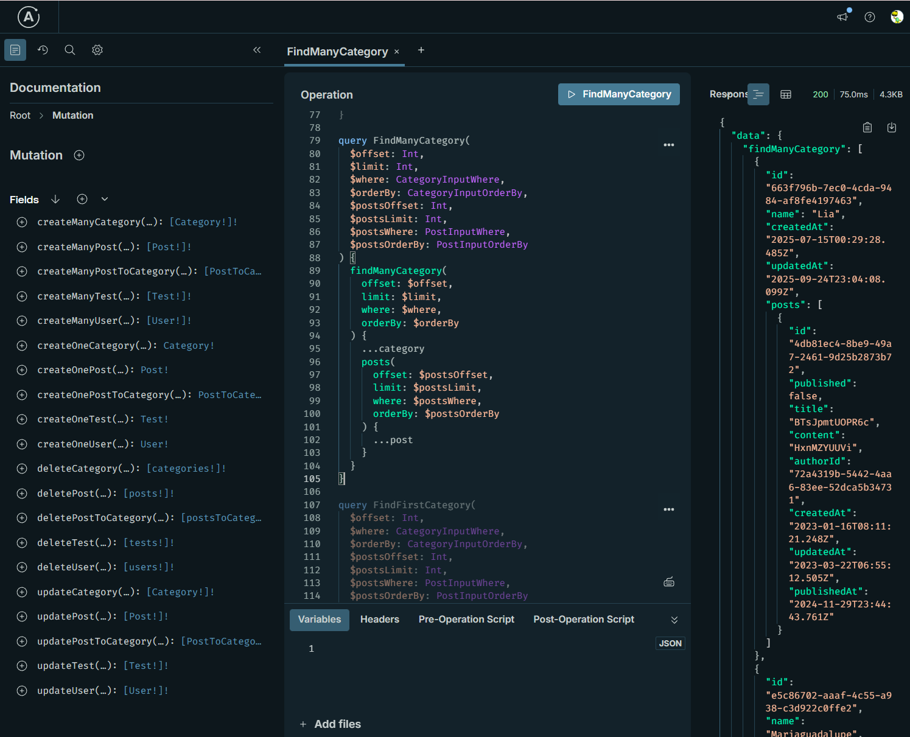

# Pothos Drizzle Generator Sample

[](https://badge.fury.io/js/pothos-drizzle-generator)

A Pothos plugin that automatically generates GraphQL schemas based on Drizzle schema information.
This sample demonstrates how to build a GraphQL API with Hono, Pothos, and Drizzle ORM using the [`pothos-drizzle-generator`](https://www.npmjs.com/package/pothos-drizzle-generator) plugin.



## Table of Contents

- [Key Features](#key-features)
- [Project Structure](#project-structure)
- [Setup and Development](#setup-and-development)
  - [Prerequisites](#prerequisites)
  - [Initialization](#initialization)
  - [Execution](#execution)
- [Available Scripts](#available-scripts)
- [How it Works](#how-it-works)
  - [1. Schema Generation (`src/builder.ts`)](#1-schema-generation-srcbuilder-ts)
  - [2. Security and Filtering](#2-security-and-filtering)
  - [3. Authentication Flow (`src/index.ts`)](#3-authentication-flow-srcindex-ts)
- [API Operations](#api-operations)

## Key Features

-   **Automatic Schema Generation**: Leverages `pothos-drizzle-generator` to generate GraphQL types, queries, and mutations directly from Drizzle ORM schemas.
-   **Role-Based Access Control (RBAC)**: Implements security at the schema level using `executable` and `where` configurations.
-   **JWT Authentication**: Secure sign-in/sign-out functionality using JSON Web Tokens (JWT) stored in HTTP-only cookies.
-   **Drizzle ORM Integration**: Seamless integration between Pothos and Drizzle for type-safe database operations.
-   **Interactive API Explorer**: Includes Apollo GraphQL Explorer for testing GraphQL operations.

## Project Structure

-   `src/index.ts`: The application's entry point, setting up the Hono server, authentication middleware, and GraphQL endpoints.
-   `src/builder.ts`: Configures the Pothos Schema Builder, including the Drizzle plugin and the schema generator. This file also defines global and model-specific security rules.
-   `src/db/`: Contains Drizzle schema and relation definitions.
-   `src/context.ts`: Defines the application context, including user information.

## Setup and Development

### Prerequisites

-   Node.js
-   Docker (for PostgreSQL)
-   pnpm

### Initialization

1.  **Install Dependencies**:

    ```sh
    pnpm install
    ```

2.  **Start Database**:

    ```sh
    pnpm run dev:docker
    ```

3.  **Run Migrations**:

    ```sh
    pnpm run drizzle:migrate
    ```

4.  **Seed Data**:

    ```sh
    pnpm run drizzle:seed
    ```

### Execution

Start the development server:

```sh
pnpm run dev
```

The server will be available at `http://localhost:3000`. You can access the Apollo Explorer at this URL to interact with the API.

## Available Scripts

-   `dev`: Starts the development server.
-   `dev:docker`: Starts the PostgreSQL database using Docker Compose.
-   `drizzle:generate`: Generates Drizzle migration files.
-   `drizzle:migrate`: Executes database migrations.
-   `drizzle:seed`: Seeds the database with initial data.
-   `drizzle:studio`: Launches Drizzle Studio.

## How it Works

### 1. Schema Generation (`src/builder.ts`)

The `pothos-drizzle-generator` plugin is configured within the `SchemaBuilder`. It automatically maps Drizzle tables to GraphQL types.

```typescript
const builder = new SchemaBuilder<PothosTypes>({
  plugins: [DrizzlePlugin, PothosDrizzleGeneratorPlugin],
  pothosDrizzleGenerator: {
    // Configuration for automatic generation
  },
});
```

### 2. Security and Filtering

Security is implemented globally and per model within `src/builder.ts`:

-   **Global Execution Control**: Prevents unauthenticated users from performing any mutations.
-   **Row-Level Security**: Uses the `where` option to filter data based on the authenticated user. For example, users can only see their own private posts or any public posts.
-   **Auto-Injection**: The `inputData` option automatically sets fields like `authorId` based on the current user session during creation.

### 3. Authentication Flow (`src/index.ts`)

-   **Middleware**: `authMiddleware` extracts the JWT from the `auth-token` cookie, verifies it using a secret key, and stores the user object in Hono's context.
-   **Mutations**: The `signIn` mutation verifies user credentials (email in this sample), generates a JWT, and sets it in a secure cookie. The `signOut` mutation clears this cookie.

## API Operations

The following operations are automatically generated for each model (unless excluded):

-   **Queries**: `findMany`, `findFirst`, `count`
-   **Mutations**: `create`, `update`, `delete`
-   **Supported Filters**: `AND`, `OR`, `NOT`, `eq`, `ne`, `gt`, `gte`, `lt`, `lte`, `like`, `in`, etc.